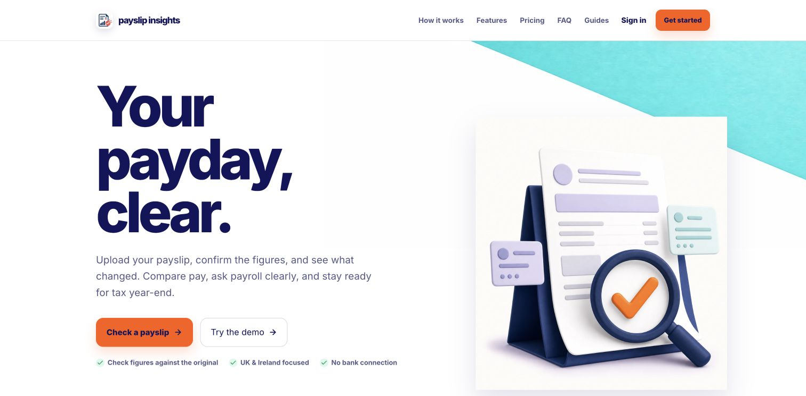
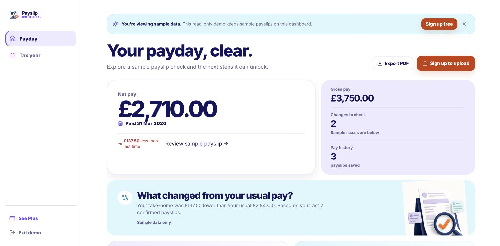
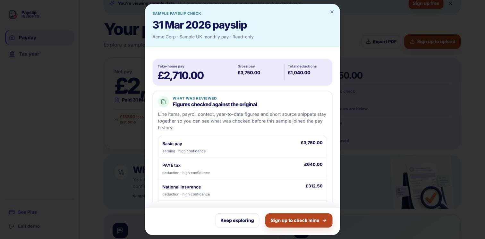
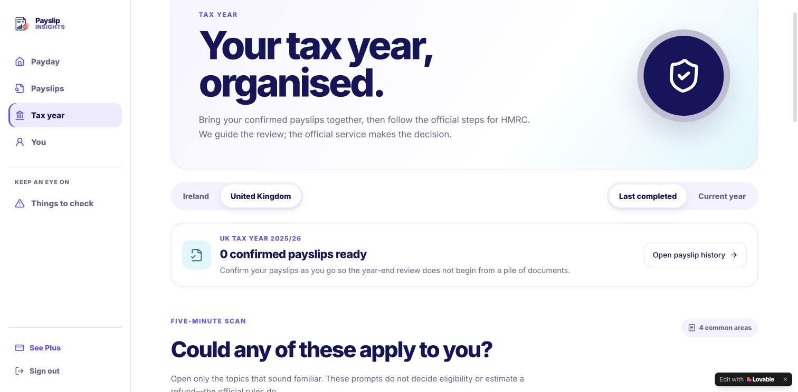
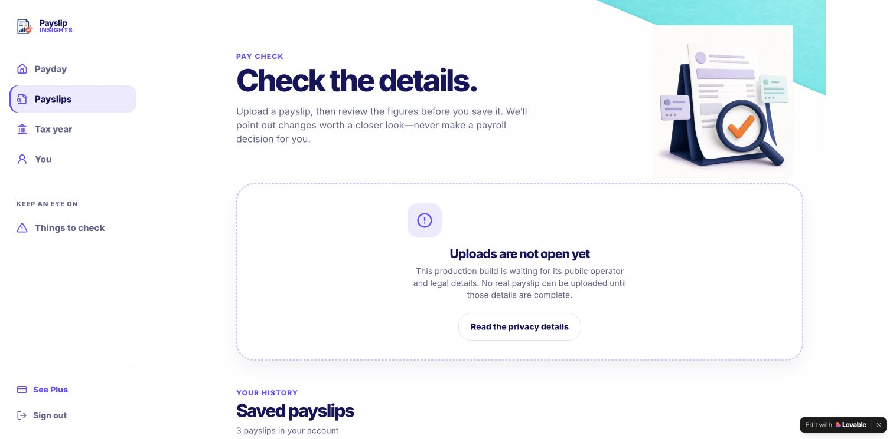
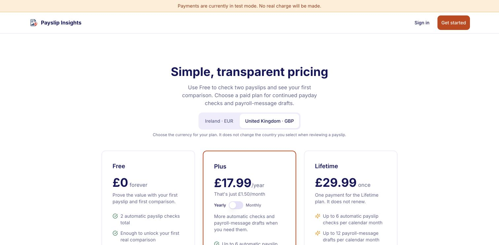
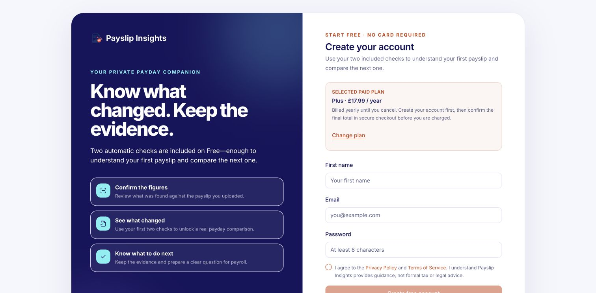
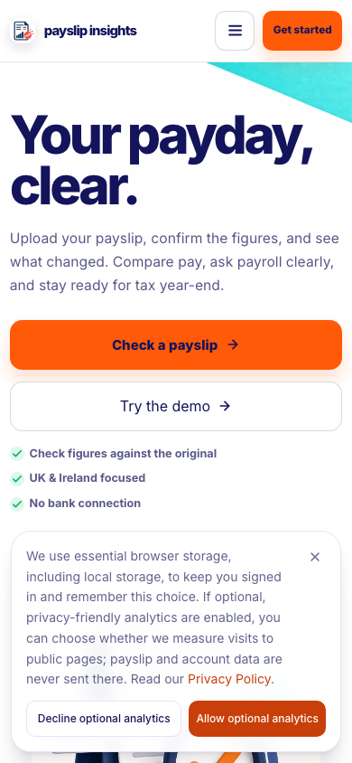
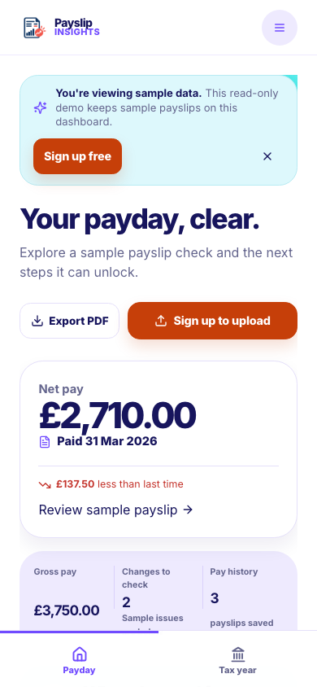
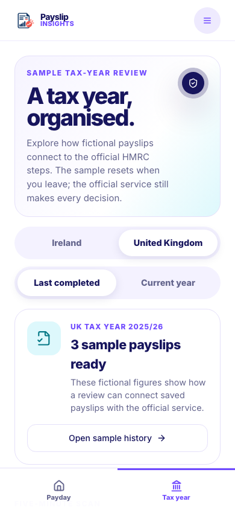

# Payslip Insights E2E and UX Audit

Audit date: 29 August 2026
Repository: `/Users/rory/Documents/Ideation/payslip-insights`
Branch audited: `agent/payslip-insights-full-build`
Public URL: `https://payslipinsights.com`
Public revision observed: `c2af16ab9f5bf119f8eb0e893f2bc41141e71f46`

## Executive Summary

The core Payslip Insights experience is coherent, restrained, and unusually clear for a financial product. The landing page explains the end-to-end value, the sample dashboard stays honest about demo data, the payslip preview turns a finding into a useful next action, and the Ireland/UK tax-year helper avoids promising refunds. The main flows also hold together at a true 390 px mobile viewport without horizontal overflow.

One repository-owned keyboard-accessibility defect was confirmed and fixed: closing the sample payslip dialog with Escape now returns focus to the exact control that opened it. Regression coverage was added.

The product is not ready for a real paid launch. Seven required production Edge Functions are absent, operator/legal configuration is incomplete, and the Lovable host is modifying the reviewed release with a public editing badge, executable script, sharing metadata on account routes, and cacheable release metadata. Customer workflows correctly remain closed while those conditions are unresolved.

## Environment and Evidence

- Live product inspected in the user's existing Chrome session on desktop.
- Local production build inspected on desktop and with Chrome device metrics set to 390 × 844.
- Local mobile measurements: `innerWidth=390`, `scrollWidth=390`, `clientWidth=390` on the landing page and sample dashboard.
- Browser console: no product runtime errors. Local-only Vite connection and React development messages were observed.
- No real checkout, upload, deletion, webhook, or account-destructive action was performed.
- The live site and the locally tested source are different revisions; screenshots are labelled accordingly.

## Coverage

| Area | Result | Evidence |
| --- | --- | --- |
| Landing and value proposition | Pass | Live/local route inspection and desktop/mobile screenshots |
| Demo dashboard | Pass | Sample labelling, anomaly presentation, history and preview entry points |
| Payslip evidence preview | Pass after fix | Dialog content, Escape close, and opener focus restoration |
| Ireland/UK tax helper | Pass | Country switch, official-source framing, and no-refund-promise language |
| Upload entry | Safe gate | Live route is deliberately fail-closed while operator configuration is incomplete |
| Pricing and currency | Pass at UI layer | EUR is the Ireland default; GBP survives from UK pricing into sign-up |
| Sign-in and session | Partial | Existing Ireland account inspected; full recovery/session-expiry matrix not run |
| Billing and Stripe | Blocked | Required production functions and real-price end-to-end evidence are incomplete |
| Upload, extraction and confirmation | Blocked | Required production functions are missing |
| Settings and account deletion | Not run | Destructive action excluded; deletion function is missing |
| API and webhooks | Blocked | No target-project deployment ownership/access |
| Mobile layout | Pass for audited routes | True 390 px landing, demo dashboard and tax helper; no horizontal overflow |
| Accessibility and keyboard | Pass after fix for audited dialog | Focus restoration verified in browser and automated regression test |

## Captured Journey

### 1. Understand the promise — healthy

The landing page explains the product loop without requiring account creation: upload, understand, compare and act. Privacy and limitations are visible before the primary action.

### 2. Explore before trusting — healthy

The sample dashboard is unmistakably a demo. It shows a useful monthly summary, a prioritised item to review, recent history and next actions without implying the figures belong to the visitor.

### 3. Inspect evidence and decide what to do — healthy after accessibility fix

The sample payslip preview ties the finding to source values and gives the user a calm next step. Escape closes it and focus now returns to the originating control.

### 4. Choose Ireland or the UK — healthy

The tax helper clearly separates Ireland and UK guidance and points users toward official sources. It does not present an estimate as an entitlement or refund promise.

### 5. Reach a closed workflow safely — healthy gate, launch blocker remains

The public upload route does not collect payslips while legal/operator and backend release conditions are incomplete. The explanation is explicit rather than failing after a user supplies sensitive data.

### 6. Understand regional pricing — healthy at the UI layer

UK pricing uses GBP and preserves the GBP plan into sign-up. Ireland defaults to EUR. This does not prove that production Stripe Checkout enforces the same rule.

### 7. Use the core product on mobile — healthy for audited routes

The landing, demo dashboard and tax helper remain readable at 390 px with no horizontal overflow. Navigation, cards and actions preserve a clear hierarchy.

## Findings

### BUG-001 — Required production functions are absent

- Severity: Release blocker
- Status: Open; external deployment access required
- Affected journeys: upload, original-payslip access, failed-upload recovery, upload cleanup, checkout return verification and account deletion
- Evidence: the target production project does not list `start-payslip-upload`, `finish-payslip-upload`, `get-payslip-original-url`, `delete-failed-payslip`, `cleanup-expired-payslip-uploads`, `verify-checkout-return`, or `delete-account`.
- User impact: the central paid workflow cannot be proven end to end.
- Current mitigation: customer workflows remain fail-closed.
- Required resolution: deploy the reviewed functions to the intended project, configure secrets, then test one real Ireland journey and one real UK journey through Stripe and the full payslip lifecycle.

### BUG-002 — The public site displays Lovable editing branding

- Severity: Major brand/release defect
- Status: Open; host-level setting
- Affected journeys: all public routes
- Evidence: the live page contains an `aside#lovable-badge` labelled “Edit with Lovable” and a host-injected script.
- User impact: the product appears unfinished and directs attention away from Payslip Insights.
- Repository boundary: the badge is not present in the reviewed application source.
- Required resolution: disable the Lovable badge in the hosting/project settings and re-run the public release verifier. Changing the public setting requires explicit action-time confirmation.

### BUG-003 — Lovable appends sharing metadata to account routes

- Severity: Major privacy/trust defect
- Status: Open; host-level behaviour
- Affected journeys: `/sign-in` and protected account route shells such as `/dashboard`
- Evidence: account routes retain the application's `noindex, nofollow` directive but receive Lovable-hosted `og:image` and `twitter:image` metadata.
- User impact: sign-in/protected route shells can acquire unintended social-preview branding despite being deliberately excluded from search.
- Required resolution: remove the host-injected sharing metadata from account routes, or move the production deployment to a host configuration that preserves the reviewed HTML.

### BUG-004 — The public release manifest is cacheable

- Severity: Major release-integrity defect
- Status: Open; host-level behaviour
- Affected journey: exact-revision verification
- Evidence: `https://payslipinsights.com/release.json` does not return the checked-in `no-store`/revalidation policy.
- User impact: a stale manifest can incorrectly suggest which revision is public.
- Required resolution: configure the host to honour the release-manifest cache policy and verify response headers on the custom domain.

### BUG-005 — Sample dialog lost keyboard focus after Escape

- Severity: Moderate accessibility defect
- Status: Fixed locally with regression coverage
- Steps before fix: open the sample payslip preview from the dashboard, press Escape, inspect the active element.
- Previous result: focus fell back to the document body.
- Correct result: focus returns to the exact sample control that opened the dialog.
- Fix: retain the opener and restore focus through the dialog close-autofocus hook.
- Verification: browser inspection and automated test both pass.

### BUG-006 — Release verifier treated inert JSON-LD as a second application script

- Severity: Minor tooling accuracy defect
- Status: Fixed locally with regression coverage
- Previous result: legitimate `application/ld+json` structured data caused the verifier to report that more than one application script existed.
- Correct result: require exactly one external module application script, allow inert JSON-LD, and separately reject additional executable scripts.
- Verification: tests now cover both the permitted structured-data case and an injected inline executable.

## Product and UX Assessment

### Strengths

- The homepage communicates the complete value loop and privacy stance without feature overload.
- Sample data is labelled consistently, supporting trust rather than manufacturing false urgency.
- Information hierarchy is calm: one primary review item, supporting history, then a clear action.
- Country-specific wording and currency presentation make Ireland/UK support feel intentional.
- The upload gate protects sensitive user data when the operational backend is unavailable.
- Mobile layouts preserve hierarchy and do not simply compress the desktop composition.

### Issues and accessibility notes

- The focus-restoration defect was the only confirmed repository-owned keyboard problem in the audited path and is fixed.
- The public Lovable badge materially weakens product credibility and visual polish.
- Host-injected account-route metadata is inconsistent with the privacy posture presented in the product.
- Broader accessibility coverage is still needed for screen-reader announcements, zoom/reflow above 200%, reduced motion, high contrast and real-device Safari.

## Automated Checks

| Check | Result | Notes |
| --- | --- | --- |
| Type checking | Pass | Current working tree |
| Lint | Pass | No errors; 9 existing Fast Refresh warnings |
| Unit/integration suite | Pass | 83 files, 403 tests |
| Edge Function source contracts | Pass | 15 source contracts; deployment not implied |
| Sites/deployment script tests | Pass | Repository behaviour only |
| iOS source preflight | Pass | Manual signing/store gates remain outside this web release |
| Production build | Pass | Current working tree |
| Public exact-release verification | Fail | Host badge/script, account-route metadata and release-manifest caching remain; public revision is older than this work |

## Untested Areas and Blockers

- Real Ireland Stripe Checkout, webhook confirmation, subscription-gated upload and account portal.
- Real UK Stripe Checkout with GBP enforcement from the signed-in profile.
- Real payslip upload, parsing, confirmation, comparison, original-file retrieval and deletion.
- Failed-upload recovery, expired-upload cleanup and account deletion.
- Password recovery, email verification, session expiry and multi-device account behaviour.
- Real-device Safari, assistive technology and network-failure testing.
- Production analytics, support, legal/operator identity and governing-law copy.

## Recommended Next Actions

1. Obtain deployment access to the intended backend and deploy the seven reviewed functions.
2. Supply truthful operator name, address and governing-law configuration; keep workflows closed until present.
3. Disable the Lovable badge and stop host injection of executable/sharing metadata on account routes.
4. Make `release.json` non-cacheable and verify the exact public revision on the custom domain.
5. Run one complete paid Ireland journey and one complete paid UK journey with disposable test accounts and real Stripe test-mode evidence.
6. Complete Safari/VoiceOver, recovery, deletion and failure-state passes before accepting customer payslips.
